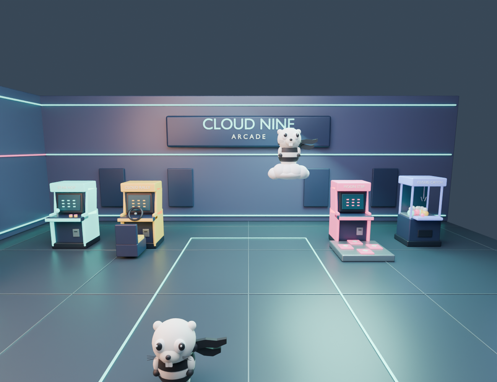

# CLOUD NINE — the arcade floor

A proof of concept: the same games the 2D launcher lists, on a floor you walk
around as the scarf gopher. Walk up to a machine, put a coin in, and the
camera pushes into the cabinet's screen until the real game grows out of it.

Live at `/arcade/cloudnine/`. The 2D grid at `/arcade/` is untouched and
remains the dependable launcher; this is the other door into the same room.



## What it does

- **Six cabinets, six real games.** `../games.json` is still the registry. A
  slug added there gets a machine here, wearing that game's own name on the
  marquee, that game's own icon on the CRT, and a neon tint derived from it.
  Nothing is hardcoded per game.
- **Put a coin in.** `E` (or the on-screen COIN button, or X on a pad) at a
  machine drops a coin, flies the camera to the glass, boots the tube, and then
  the game — the actual game, in an iframe — appears *on the cabinet screen* at
  cabinet size for a beat before it opens out to fill the viewport. Stepping
  away reverses the whole move.
- **Ride the cloud.** Jump, then jump again in the air, and the gopher swaps to
  the cloud-riding model and flies over the machines. Hold `Space` to rise,
  `Shift` to sink, touch the floor to land.
- **Walk out.** The entrance is a real exit: walk through it and you are back
  at the 2D launcher.

## Controls

| Input | On foot | On the cloud |
| --- | --- | --- |
| `W` `A` `S` `D` / arrows | Walk, relative to the camera | Fly |
| `Space` | Hop. Again in the air to take off | Hold to rise |
| `Shift` | Sprint | Hold to sink |
| `E` / `Enter` | Insert a coin at the machine you are at | — |
| `Escape` | Pause; or leave a running game | Pause |
| Drag / wheel | Orbit / zoom | Same |

Touch gets a floating stick on the left half, hop and sprint on the right, and
a COIN button that only exists while a machine is within reach. A gamepad
works too: left stick walks, right stick looks, A hops, X or B is the coin,
Start pauses.

## Running it

Nothing to build. Serve the hub and open the page:

```sh
cd ~/projects/games
python3 -m http.server 8000
# http://127.0.0.1:8000/arcade/cloudnine/
```

Games are resolved as siblings of `/arcade/` on whatever origin is serving the
page, so a locally served hub finds its locally served games and needs no
network beyond the first load of Babylon. `games.json`'s `origin` is the
fallback when nothing answers locally. See the header of `js/registry.js`.

Babylon.js comes from jsDelivr, pinned to 8.56.2 with an integrity hash — the
same pin fishtank ships, so a visitor who has played that already has the
bytes. There is no vendored copy, so **the first visit needs the network**; the
boot card says so plainly if the script never arrives. After that the service
worker at `/arcade/` has everything, and the models and theme live in its
unversioned runtime cache so a launcher release does not evict nine megabytes.

## How it is put together

| File | Owns |
| --- | --- |
| `js/main.js` | Phases, movement, collision, the camera, the coin |
| `js/room.js` | The building, the floor plan, and the Blender↔Babylon axis conversion |
| `js/cabinets.js` | One machine per game: tint, marquee, CRT art, floor mark |
| `js/gopher.js` | Two models, one pivot, and all the procedural animation |
| `js/launcher.js` | The handover from cabinet screen to running game |
| `js/registry.js` | `games.json` → titles, icons, colours, URLs |
| `js/controls.js` | Keyboard, touch stick, gamepad, all answering the same questions |
| `js/audio.js` | The room synthesized, plus the theme on its own bus |

Read the header of `js/room.js` before touching any coordinate. Blender is
Z-up and the glTF loader mirrors X, and the two together are the only thing
standing between you and a CLOUD NINE sign behind your head.

### The one thing that is not real

You cannot texture an iframe onto a mesh — WebGL cannot sample a live
document, and no trick makes it possible. So the game is never *on* the model.
What happens instead is that the CRT's corners are projected from 3D into
screen pixels and the game's iframe is revealed through a `clip-path` matching
that rectangle, scaled down to fit it, then both animate away. The cabinet
screen becomes the game's screen becomes the whole screen, and the only thing
that moved was a clip. `js/launcher.js` explains the mechanics.

## Assets

Models come from `../assets/3d/`, which is a static kit with its own
[README](../assets/3d/README.md):

- `arcade-room.glb`, `arcade-ceiling.glb` — the building
- `machine-classic.glb`, `machine-racer.glb`, `machine-dance.glb` — the three
  cabinet kinds, cycled across the games and stamped out of one `AssetContainer`
  each with materials cloned so a per-cabinet tint is possible
- `machine-claw.glb` — prize machines, scenery only
- `gopher-scarf.glb`, `gopher-scarf-cloud.glb` — the player, in both forms
- `arcade-props.glb` — set dressing added for this game, built by
  `../assets/3d/source/build_extras.py`

`audio/theme.mp3` is the room's theme, looped with `loopStart` set past the
decoder's priming silence so the seam is inaudible. It has its own switch in
the pause menu, separate from the room's synthesized sound, and it ducks
rather than restarts while a game has the machine.

## Known limits

These are honest, not oversights.

- **One online visit before it works offline**, because Babylon is not
  vendored and the models are 2.5 MB.
- **Nothing is merged.** About 400 meshes, world matrices frozen and picking
  off, one glow pass. Comfortable on a laptop and fine on a recent tablet; if
  it needs to be cheaper, merging each cabinet into one multi-material mesh is
  the next move, and the reason it was not done here is that the glTF loader's
  mirrored root makes `MergeMeshes` a coin toss on winding order.
- **The floor plan holds twelve machines.** Beyond that, games in `games.json`
  simply do not get a cabinet. The slot list in `js/room.js` is a floor plan,
  not a limit on the arcade.
- **The registry logic is duplicated** from `arcade.js` — about 70 lines. It is
  deliberate: `arcade.js` is a classic script on one IIFE and this is an ES
  module, so sharing means converting the working launcher. If this graduates,
  lift the resolver into one module and import it in both.
- **`Escape` only leaves a game when this page has focus**, which it usually
  does not once the game has loaded. The `◂ FLOOR` pill is the way out, and the
  back button works too.

## Playtest checklist

1. Title card shows over the room, camera drifting. **Walk in.**
2. Walk to a back-wall machine — the mark under you lights, the callout names
   the game, the gopher turns to face it and reaches up.
3. `E`. Coin, camera to the glass, the game appears **on the cabinet screen**,
   then opens out. Play it.
4. `◂ FLOOR`. The game shrinks back into the cabinet and the camera pulls out.
   The HUD is back, the URL hash is clear, no iframe is left behind.
5. Back button from inside a game leaves it the same way.
6. Jump, jump again — cloud. Fly over the machines. Land.
7. Sound: room hum plus distant blips, footsteps in time with the feet, coin,
   tube strike. Both switches in the pause menu do what they say and survive a
   reload.
8. Walk out of the entrance. The room dims and you are at `/arcade/`.
9. `#play=supermine` in the URL should land you straight in that game.
